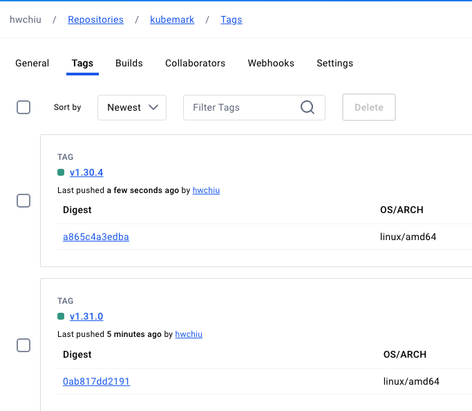
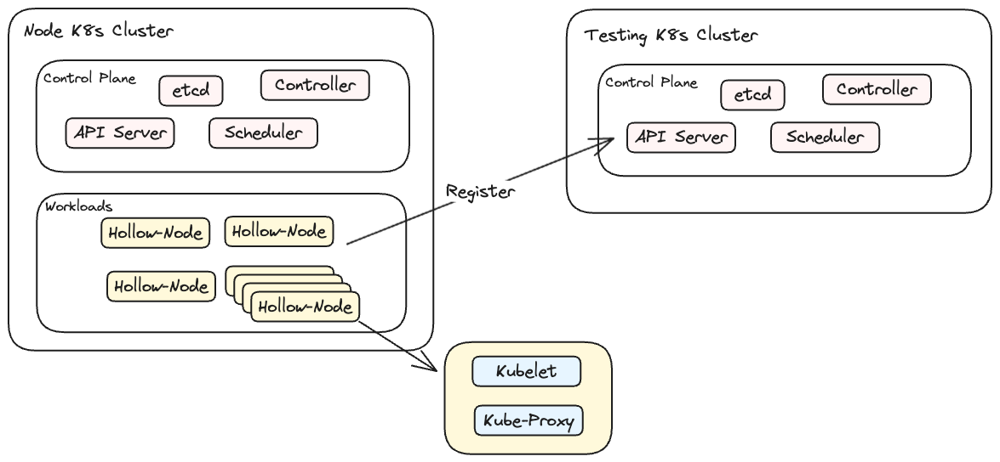

# Preface

Kubemark 是一個官方提供的工具，該工具讓叢集管理員可以透過模擬的方式來擴大 K8s cluster 的節點數量，不論是針對效能或是功能，都能夠產生數百到數千的節點量來幫助開發者更加瞭解自己開發應用的極限。

Kubemark 的本質上是透過將 Kubelet 給封裝到容器內，透過部署大量的 Pod 就可以產生出大量的 Node，而這些 Node 再與目標區待測得 K8s Cluster 去相連就可以註冊大量的 Kubernetes 節點。


# Prepare Kubemark

由於 Kubemark 要模擬不同版本的 Kubernetes，因此建議針對不同版本的 Kubernetes 都要有對應的版本，而鎖定版本最簡單的方式還是從 Kubernetes 官方版本去建構相對應的檔案。

因此底下我們將會針對 K8s 1.30, 1.31 兩個版本分別編譯出兩個版本，並且容器化後上傳到 DockerHub 供未來使用。

以下流程分別是
1. 從 Kubernetes 官方下載相關程式碼
2. 切換到對應的 Branch
3. Build Kubemark 
4. 將 Kubemark 打包成容器
5. 上傳到 Dockerhub

首先，目前所有的程式碼都放到官方 Github 上，所以透過 git clone 可以抓取，並且透過 checkout 切換到目標 branch.
```
git clone https://github.com/kubernetes/kubernetes.git
cd kubernetes
git checkout v1.31.0
```

接下來請確保環境內有 golang 以及 make 相關指令
```
make WHAT='cmd/kubemark/'
```
上述流程跑完後，會於 _output/local/bin/linux/amd64/ 產生一個編譯好的檔案 `kubemark`，我們需要將該檔案複製到其他目錄來進行容器化的包裝

```
cp _output/local/bin/linux/amd64/kubemark cluster/images/kubemark/
cd cluster/images/kubemark/
make REGISTRY=hwchiu IMAGE_TAG=v1.31.0 push
```
上述的 make 指令會嘗試透過 docker build 並且推到指定的 REGISTRY，上述範例則會產生 image 到 docker hub 下。

反覆上述流程針對 v1.31.0 以及 v1.30.4 後可以得到下列兩個 image



此外，目前 kubemark 裡面有將 CR 給寫死到  "unix:///run/containerd/containerd.sock"
https://github.com/kubernetes/kubernetes/blob/release-1.31/pkg/kubemark/hollow_kubelet.go#L171

這意味該 cluster 必須要提供基於 containerd 的 unix socket 才可以使用，若使用 cri-o 的話則沒有辦法。

因此我這邊也針對 crio 的部分自行修改程式碼並且建置一個額外的版本供測試使用


# Environment 

為了讓整個測試環境簡單與乾淨，這邊部署兩套 v1.31.0 的 Kubernetes Cluster，其中
1. Cluster1 的目的是用來部署 Kubemark，習慣上會稱為 Hollow Node Cluster，該 Cluster 內所有的 Kubemark Pod 都會註冊為另外一個 Cluster 的 Kubernetes Node
2. Cluster2 的則是待測 Cluster，等待 Kubemark 向其註冊，最終應該要可以看到很多透過模擬的 Kubernetes 節點

其架構如下w



Hollow-Node 是一個普通的 Pod，該 Pod 中含有兩個 Container，這兩個 Container 分別扮演 Kubelet 以及 Kube-Proxy 的角色。


# Installation

要能夠向 API Server 註冊一個節點，必須要有能力能夠跟 API Server 溝通，這邊最簡單的方式就是獲取該 Cluster 的 Kubeconfig。
該 Kubeconfig 我們會需要安裝到 Kubernetes 中，並且以 Secret 的方式給掛載到每個 Hollow-Node 上。

假設該 kubeconfig 的名稱是 cluster_config，執行下列指令
```bash=
kubectl create ns kubemark
kubectl create secret generic kubeconfig --type=Opaque --namespace=kubemark --from-file=kubelet.kubeconfig=cluster_config --from-file=kubeproxy.kubeconfig=cluster_config
```

接者準備一個用來部署 Hollow Node 的 YAML。該檔案會部署很多 kubemark 的 Pod，每個 Pod 會包含
1. 一個 Init Container，用來設定節點 fs inotify 的上限，估計是給 kubelet/kubeproxy 的 log 用的
2. 兩個主要 container，分別用來代表 kubeproxy 以及 kubelet

範例是使用 replicationController，可以自行切換成 Deployment

```yaml=
apiVersion: v1
kind: ReplicationController
metadata:
  name: hollow-node
  namespace: kubemark
  labels:
    name: hollow-node
spec:
  replicas: 100
  selector:
    name: hollow-node
  template:
    metadata:
      labels:
        name: hollow-node
    spec:
      initContainers:
      - name: init-inotify-limit
        image: busybox:1.32
        command: ['sysctl', '-w', 'fs.inotify.max_user_instances=1000']
        securityContext:
          privileged: true
      volumes:
      - name: kubeconfig-volume
        secret:
          secretName: kubeconfig
      - name: kernelmonitorconfig-volume
        configMap:
          name: node-configmap
      - name: logs-volume
        hostPath:
          path: /var/log
      - name: containerd
        hostPath:
          path: /run/crio
      - name: no-serviceaccount-access-to-real-master
        emptyDir: {}
      containers:
      - name: hollow-kubelet
        image: hwchiu/kubemark:v1.31.0-crio-dev
        ports:
        - containerPort: 4194
        - containerPort: 10250
        - containerPort: 10255
        env:
        - name: NODE_NAME
          valueFrom:
            fieldRef:
              fieldPath: metadata.name
        command: [
          "/go-runner",
          "-log-file=/var/log/kubelet-$(NODE_NAME).log",
          "/kubemark",
          "--morph=kubelet",
          "--containerd=/run/crio/crio.sock",
          "--name=$(NODE_NAME)",
          "--node-labels=hollow-node=true",
          "--kubeconfig=/kubeconfig/kubelet.kubeconfig",
        ]
        volumeMounts:
        - name: kubeconfig-volume
          mountPath: /kubeconfig
          readOnly: true
        - name: logs-volume
          mountPath: /var/log
        - name: containerd
          mountPath: /run/crio
        resources:
          requests:
            cpu: 40m
            memory: 100Mi
        securityContext:
          privileged: true
      - name: hollow-proxy
        image: hwchiu/kubemark:v1.31.0-crio-dev
        imagePullPolicy: Always
        env:
        - name: NODE_NAME
          valueFrom:
            fieldRef:
              fieldPath: metadata.name
        command: [
          "/go-runner",
          "-log-file=/var/log/kubeproxy-$(NODE_NAME).log",
          "/kubemark",
          "--morph=proxy",
          "--name=$(NODE_NAME)",
          "--v=9",
          "--kubeconfig=/kubeconfig/kubeproxy.kubeconfig",
        ]
        volumeMounts:
        - name: kubeconfig-volume
          mountPath: /kubeconfig
          readOnly: true
        - name: logs-volume
          mountPath: /var/log
        resources:
          requests:
            cpu: 40m
            memory: 100Mi          
```

上述 YAML 使用的 image 是 "v1.31.0-crio-dev"，這邊使用的是我自己客製化的結果，最後會再詳細介紹修改的部分。

先簡單看一下上述 YAML 的相關設定
**hollow-kubelet**
1. Replication 是 100, 代表有 100 個 Pod 也就是有 100 個模擬的節點
2. Kubemark 透過 morph 的指令來決定要運行哪種模式
3. 透過 -log-file 將每個節點的 log 指令都寫到 K8s 節點上
4. containerd 的設定是給 CAdvisor 的，並非是給 kubelet 的
5. --name 的部分則是透過 downward API 取得 Pod 的名稱，並且透過此名稱來設定節點的名稱
6. --node-lables 是針對節點設定 label，後續要進行過濾與刪除也比較好操作
7. --kubeconfig 則是把前述安裝的 secret 中的 kubeconfig 拿來使用。

**hollow-proxy**
1. 透過 morph 設定為 proxy 模式
2. 一樣透過 -log-file 去設定輸出的檔案名稱
3. 後續大同小異

上述檔案部署後，就可以觀察到下列內容

**node k8s cluster**
```
root@node-k8s-1:~# kubectl -n kubemark get pods
NAME                READY   STATUS    RESTARTS   AGE
hollow-node-26m9k   2/2     Running   2          18h
hollow-node-28bwz   2/2     Running   2          18h
hollow-node-2pmns   2/2     Running   2          18h
hollow-node-2vgjr   2/2     Running   2          18h
hollow-node-2zpr2   2/2     Running   2          18h
hollow-node-4xjkq   2/2     Running   2          18h
hollow-node-55blr   2/2     Running   2          18h
hollow-node-56r85   2/2     Running   2          18h
hollow-node-5dvqd   2/2     Running   2          18h
hollow-node-5jpkw   0/2     Pending   0          18h
hollow-node-5stkv   2/2     Running   2          18h
hollow-node-6h447   2/2     Running   2          18h
hollow-node-6nbcp   2/2     Running   2          18h
hollow-node-78z6f   2/2     Running   2          18h
hollow-node-7d5qg   2/2     Running   2          18h
hollow-node-7kr98   2/2     Running   2          18h
hollow-node-84wn9   2/2     Running   2          18h
hollow-node-87xm4   2/2     Running   2          18h
hollow-node-8d74t   2/2     Running   2          18h
hollow-node-94crg   2/2     Running   2          18h
hollow-node-9frdz   2/2     Running   2          18h
hollow-node-9kjzg   2/2     Running   2          18h
hollow-node-9zr8t   2/2     Running   2          18h
hollow-node-b8v6d   2/2     Running   2          18h
hollow-node-bhsx6   2/2     Running   2          18h
hollow-node-bnpjw   2/2     Running   2          18h
hollow-node-bzb6n   2/2     Running   2          18h
hollow-node-c799k   2/2     Running   2          18h
hollow-node-c9cph   2/2     Running   2          18h
hollow-node-c9lfr   2/2     Running   2          18h
hollow-node-cb4rp   2/2     Running   2          18h
hollow-node-cqhtj   2/2     Running   2          18h
```

可以看到當這些 Hollow-Node Pod 都順利起來後，目標(Testing K8s Cluster) 可以看到很多節點被註冊
```bash=
root@test-cluster-1:~# kubectl get nodes
NAME                STATUS   ROLES           AGE     VERSION
hollow-node-26m9k   Ready    <none>          18h     v1.31.0-dirty
hollow-node-28bwz   Ready    <none>          18h     v1.31.0-dirty
hollow-node-2pmns   Ready    <none>          18h     v1.31.0-dirty
hollow-node-2vgjr   Ready    <none>          18h     v1.31.0-dirty
hollow-node-2zpr2   Ready    <none>          18h     v1.31.0-dirty
hollow-node-4xjkq   Ready    <none>          18h     v1.31.0-dirty
hollow-node-55blr   Ready    <none>          18h     v1.31.0-dirty
hollow-node-56r85   Ready    <none>          18h     v1.31.0-dirty
hollow-node-5dvqd   Ready    <none>          18h     v1.31.0-dirty
hollow-node-5stkv   Ready    <none>          18h     v1.31.0-dirty
hollow-node-6h447   Ready    <none>          18h     v1.31.0-dirty
hollow-node-6nbcp   Ready    <none>          18h     v1.31.0-dirty
hollow-node-78z6f   Ready    <none>          18h     v1.31.0-dirty
hollow-node-7d5qg   Ready    <none>          18h     v1.31.0-dirty
hollow-node-7kr98   Ready    <none>          18h     v1.31.0-dirty
hollow-node-84wn9   Ready    <none>          18h     v1.31.0-dirty
hollow-node-87xm4   Ready    <none>          18h     v1.31.0-dirty
hollow-node-8d74t   Ready    <none>          18h     v1.31.0-dirty
hollow-node-94crg   Ready    <none>          18h     v1.31.0-dirty
hollow-node-9frdz   Ready    <none>          18h     v1.31.0-dirty
hollow-node-9kjzg   Ready    <none>          18h     v1.31.0-dirty
hollow-node-9zr8t   Ready    <none>          18h     v1.31.0-dirty
hollow-node-b8v6d   Ready    <none>          18h     v1.31.0-dirty
hollow-node-bhsx6   Ready    <none>          18h     v1.31.0-dirty
hollow-node-bnpjw   Ready    <none>          18h     v1.31.0-dirty
hollow-node-bzb6n   Ready    <none>          18h     v1.31.0-dirty
hollow-node-c799k   Ready    <none>          18h     v1.31.0-dirty
hollow-node-c9cph   Ready    <none>          18h     v1.31.0-dirty
hollow-node-c9lfr   Ready    <none>          18h     v1.31.0-dirty
hollow-node-cb4rp   Ready    <none>          18h     v1.31.0-dirty
hollow-node-cqhtj   Ready    <none>          18h     v1.31.0-dirty
hollow-node-csbrn   Ready    <none>          18h     v1.31.0-dirty
hollow-node-czqcr   Ready    <none>          18h     v1.31.0-dirty
hollow-node-d5xh2   Ready    <none>          18h     v1.31.0-dirty
hollow-node-d68nk   Ready    <none>          18h     v1.31.0-dirty
hollow-node-dg5dj   Ready    <none>          18h     v1.31.0-dirty
hollow-node-fbc45   Ready    <none>          18h     v1.31.0-dirty
hollow-node-g7ht9   Ready    <none>          18h     v1.31.0-dirty
hollow-node-g9g5p   Ready    <none>          18h     v1.31.0-dirty
hollow-node-gdb68   Ready    <none>          18h     v1.31.0-dirty
hollow-node-gdxkn   Ready    <none>          18h     v1.31.0-dirty
hollow-node-gm4nh   Ready    <none>          18h     v1.31.0-dirty
```

這時候如果去看這些 Pod 所部署的節點內容的話，可以觀察到相關的 log

```bash=
root@node-cluster-2:/var/log# ls /var/log/kube*
/var/log/kubelet-hollow-node-26m9k.log  /var/log/kubelet-hollow-node-bzb6n.log  /var/log/kubelet-hollow-node-ksw8w.log  /var/log/kubelet-hollow-node-rshs2.log    /var/log/kubeproxy-hollow-node-28bwz.log  /var/log/kubeproxy-hollow-node-c799k.log  /var/log/kubeproxy-hollow-node-l522t.log  /var/log/kubeproxy-hollow-node-s25wv.log
```

這時候如果將所有 Hollow-Pod 都移除的話，這些節點就會因為喪失 kubelet 的連線，最後都進入到 NodeNotReady 的狀況，需要移除的話必須要透過 kubectl detele nodes 的指令去移除
```bash=
~# kubectl get nodes
NAME                STATUS     ROLES           AGE     VERSION
hollow-node-26m9k   NotReady   <none>          18h     v1.31.0-dirty
hollow-node-28bwz   NotReady   <none>          18h     v1.31.0-dirty
hollow-node-2pmns   NotReady   <none>          18h     v1.31.0-dirty
hollow-node-2vgjr   NotReady   <none>          18h     v1.31.0-dirty
hollow-node-2zpr2   NotReady   <none>          18h     v1.31.0-dirty
hollow-node-4xjkq   NotReady   <none>          18h     v1.31.0-dirty
hollow-node-55blr   NotReady   <none>          18h     v1.31.0-dirty
hollow-node-56r85   NotReady   <none>          18h     v1.31.0-dirty
hollow-node-5dvqd   NotReady   <none>          18h     v1.31.0-dirty
hollow-node-5stkv   NotReady   <none>          18h     v1.31.0-dirty
hollow-node-6h447   NotReady   <none>          18h     v1.31.0-dirty
hollow-node-6nbcp   NotReady   <none>          18h     v1.31.0-dirty
hollow-node-78z6f   NotReady   <none>          18h     v1.31.0-dirty
hollow-node-7d5qg   NotReady   <none>          18h     v1.31.0-dirty
hollow-node-7kr98   NotReady   <none>          18h     v1.31.0-dirty
hollow-node-84wn9   NotReady   <none>          18h     v1.31.0-dirty
hollow-node-87xm4   NotReady   <none>          18h     v1.31.0-dirty
hollow-node-8d74t   NotReady   <none>          18h     v1.31.0-dirty
hollow-node-94crg   NotReady   <none>          18h     v1.31.0-dirty
hollow-node-9frdz   NotReady   <none>          18h     v1.31.0-dirty
```

可以透過前述的 label 來簡化移除流程
```
kubectl delete nodes -l hollow-node=true
```

# Issue

最原始的 kubemark 運行的時候會遇到兩個問題
1. contaienrd unix socket 的問題，該問題可以透過修改 `pkg/kubemark/hollow_kubelet.go` 來修改成 crio 的位置，如果本身就是使用 containerd 的話則沒有需要

```bash=
--- a/pkg/kubemark/hollow_kubelet.go
+++ b/pkg/kubemark/hollow_kubelet.go
@@ -168,7 +168,7 @@ func GetHollowKubeletConfig(opt *HollowKubeletOptions) (*options.KubeletFlags, *
                panic(err)
        }

-       c.ImageServiceEndpoint = "unix:///run/containerd/containerd.sock"
+       c.ImageServiceEndpoint = "unix:///run/crio/crio.sock"
        c.StaticPodURL = ""
        c.EnableServer = true
        c.Address = "0.0.0.0" /* bind address */
~
```

2. 當前述問題修正後， kubelet 就可以正常運作，不過此時 kube-proxy 則是會遇到 nil pointer 的問題導致沒有辦法順利起來，透過檢查節點上的 /var/log/kubeproxy-xxxx.log
```
E0907 12:36:03.288062       6 runtime.go:79] Observed a panic: "invalid memory address or nil pointer dereference" (runtime error: invalid memory address or nil pointer dereference)
goroutine 46 [running]:
k8s.io/apimachinery/pkg/util/runtime.logPanic({0x366f260, 0x6154720})
        k8s.io/apimachinery/pkg/util/runtime/runtime.go:75 +0x85
k8s.io/apimachinery/pkg/util/runtime.HandleCrash({0x0, 0x0, 0xc000826380?})
        k8s.io/apimachinery/pkg/util/runtime/runtime.go:49 +0x6b
panic({0x366f260?, 0x6154720?})
        runtime/panic.go:770 +0x132
k8s.io/kubernetes/pkg/proxy/healthcheck.(*ProxierHealthServer).SyncNode(0x0, 0xc000ae2308)
        k8s.io/kubernetes/pkg/proxy/healthcheck/proxier_health.go:142 +0x6d
k8s.io/kubernetes/pkg/proxy.(*NodeEligibleHandler).OnNodeAdd(0xc00008b0d8, 0xc000ae2308)
        k8s.io/kubernetes/pkg/proxy/node.go:102 +0x57
k8s.io/kubernetes/pkg/proxy/config.(*NodeConfig).handleAddNode(0xc000665440, {0x3da4c60?, 0xc000ae2308?})
        k8s.io/kubernetes/pkg/proxy/config/config.go:339 +0x12a
k8s.io/client-go/tools/cache.ResourceEventHandlerFuncs.OnAdd(...)
        k8s.io/client-go/tools/cache/controller.go:239
k8s.io/client-go/tools/cache.(*processorListener).run.func1()
        k8s.io/client-go/tools/cache/shared_informer.go:978 +0x13e
k8s.io/apimachinery/pkg/util/wait.BackoffUntil.func1(0x30?)
        k8s.io/apimachinery/pkg/util/wait/backoff.go:226 +0x33
k8s.io/apimachinery/pkg/util/wait.BackoffUntil(0xc0004edf70, {0x4371540, 0xc000904000}, 0x1, 0xc000902000)
        k8s.io/apimachinery/pkg/util/wait/backoff.go:227 +0xaf
k8s.io/apimachinery/pkg/util/wait.JitterUntil(0xc000881770, 0x3b9aca00, 0x0, 0x1, 0xc000902000)
        k8s.io/apimachinery/pkg/util/wait/backoff.go:204 +0x7f
k8s.io/apimachinery/pkg/util/wait.Until(...)
        k8s.io/apimachinery/pkg/util/wait/backoff.go:161
k8s.io/client-go/tools/cache.(*processorListener).run(0xc0006dc630)
        k8s.io/client-go/tools/cache/shared_informer.go:972 +0x69
k8s.io/apimachinery/pkg/util/wait.(*Group).Start.func1()
        k8s.io/apimachinery/pkg/util/wait/wait.go:72 +0x52
created by k8s.io/apimachinery/pkg/util/wait.(*Group).Start in goroutine 187
        k8s.io/apimachinery/pkg/util/wait/wait.go:70 +0x73
I0907 12:36:03.288125       6 config.go:120] "Calling handler.OnEndpointSliceAdd" endpoints="default/kubernetes"
panic: runtime error: invalid memory address or nil pointer dereference [recovered]
        panic: runtime error: invalid memory address or nil pointer dereference
[signal SIGSEGV: segmentation violation code=0x1 addr=0x0 pc=0x30fea8d]
```

**以下都是我個人的研究與猜測，尚未獲得證實**

嘗試去理解這段程式碼，可以觀察到應該是 kube-proxy 運作的時候會去註冊一個 [Event Handler](https://github.com/kubernetes/kubernetes/blob/master/cmd/kube-proxy/app/server.go#L574-L577)
```golang=
if utilfeature.DefaultFeatureGate.Enabled(features.KubeProxyDrainingTerminatingNodes) {
    nodeConfig.RegisterEventHandler(&proxy.NodeEligibleHandler{
        HealthServer: s.HealthzServer,
    })
}
```
但是我們 kubemark 的流程下，這個物件 `HealthServer` 本身是一個空物件，所以當未來事件發生時，要去呼叫就會得上述 invalid memory dereference 的錯誤訊息。
正常形況下 kube-proxy [初始化](https://github.com/kubernetes/kubernetes/blob/master/cmd/kube-proxy/app/server.go#L223-L225)的時候會去初始化這個變數

```golang=
if len(config.HealthzBindAddress) > 0 {
    s.HealthzServer = healthcheck.NewProxierHealthServer(config.HealthzBindAddress, 2*config.SyncPeriod.Duration)
}
```

不過 kubemark 本身則沒有呼叫這個流程，而是直接[初始化](https://github.com/kubernetes/kubernetes/blob/master/pkg/proxy/kubemark/hollow_proxy.go)對應的物件
```golang=
return &HollowProxy{
    ProxyServer: &proxyapp.ProxyServer{
        Config: &proxyconfigapi.KubeProxyConfiguration{
            Mode:             proxyconfigapi.ProxyMode("fake"),
            ConfigSyncPeriod: metav1.Duration{Duration: 30 * time.Second},
            Linux: proxyconfigapi.KubeProxyLinuxConfiguration{
                OOMScoreAdj: ptr.To[int32](0),
            },
        },

        Client:      client,
        Proxier:     &FakeProxier{},
        Broadcaster: broadcaster,
        Recorder:    recorder,
        NodeRef: &v1.ObjectReference{
            Kind:      "Node",
            Name:      nodeName,
            UID:       types.UID(nodeName),
            Namespace: "",
        },
    },
}
```

從最上面事件的註冊來看，環境中必須要先開啟一個 feature gate 才會執行，該 feature gate 過往都是 alpha 直到 1.30 才轉為 Beta 並且變成預設執行。
因此這個問題的修正情況有幾個
1. 關閉該 feature gate，避免不需要的註冊
2. 忽略該註冊

由於本測試環境中已經針對 crio 去自行修改程式碼，所以就走 (2) 的方式，將相關的程式碼給註解掉，因此最後部署的環境才會使用一個名為 v1.31.0-crio-dev 的檔案，該檔案就包含上述測試。

根據理解，理論上使用 v1.29.0 的環境應該就不會撞到此問題，不過還沒有針對 v1.29.0 去驗證。

# Summary
1. Kubemark 是一套可以透過 k8s pod 轉變去註冊 k8s 節點的工具
2. 每個 Pod 都會運行兩個 container，分別是 kubelet 與 kube-proxy
3. Kubemark 的目的是用來驗證 Controller 等相關工具的規模性，由於該節點是模擬的，因此過於複雜的 CNI 勢必會遇到很多問題，因此不適合用來驗證網路方面的效能與應用
4. Kubemark 沒有官方的 Image，使用上請自行下載並且編譯
