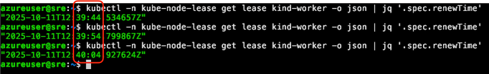
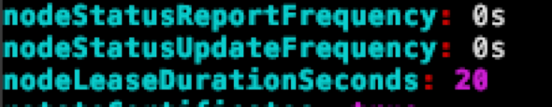
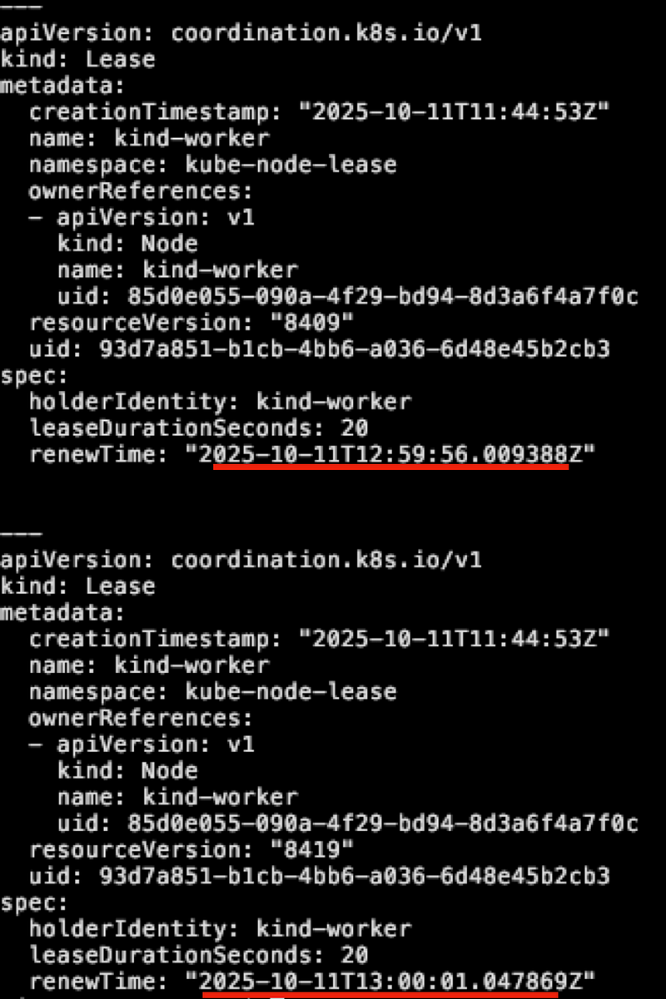
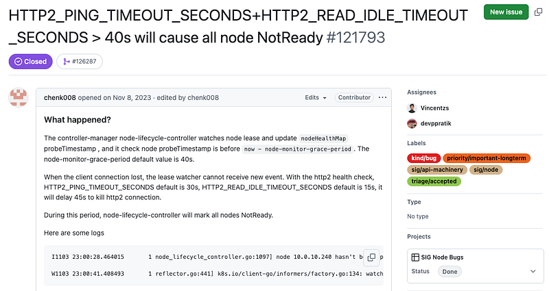
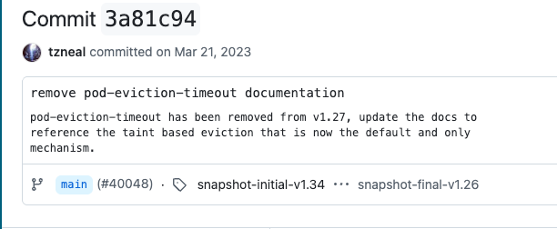
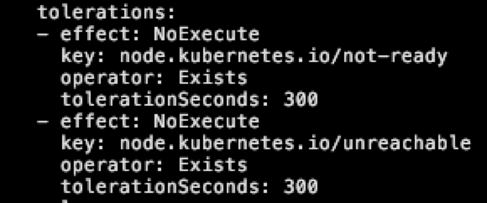

# Preface

Kubernetes 容器平台有很多優勢與特典，這些強調的能力就是希望減緩管理的負擔，讓所有運行的服務可以再不太需要考慮底層節點的狀況下去自動擴容與修復，藉此解放系統管理員去手動調度與擴展服務的需求．
然而 Kubernetes 本身的實作邏輯與方式是否真的符合我們的認知與期望？

本篇文章會專注於節點損壞時的自我修復機制去探討，重新盤點下目前 Kubernetes 的實作方式與效果，

# Testing Environment

1. Ubuntu 24.04
2. 使用 KIND 搭建一個有三個 worker node 的 1.34 K8s

## Case 1
1. 透過 Deployment 部署一個不用 PVC 的 Pod，副本為 1
2. 透過 docker stop kind-workerx 的指令關機

觀察多久後，該 Pod 會被移除然後重新部署到其他節點

## Case 2
1. 透過 Statefulset 部署一個不用 PVC 的 Pod，副本為 1
2. 透過 docker stop kind-workerx 的指令關機

觀察多久後，該 Pod 會被移除然後重新部署到其他節點

## 結果觀察

針對上述情況，我們可以觀察完全截然不同的答案
針對 Deployment 這種 Stateless 的服務，Pod 大概 6 分鐘左右就會被重新部署到另外一個節點，然而 Statefulset 則是會觀察到 Pod 卡在 Terminating 沒有後續，不論多久都不會看到該 Pod 被重新調度到其他節點

# 結果分析

上述的結果有兩個問題需要分別去探討，分別是
1. 為什麼 Stateless 需要大概 6 分鐘左右才會被重新部署
2. 為什麼 Stateful 永遠都長不回來？

這兩個問題說大也不是很大，說小也不是很小，更加重要的反而是我們必須要認知預設的 Kubernetes 會有這些現象，因此後期維護 Kubernetes 時才能夠預料到會發生的各種事情．

以應用程式的角度來說
1. Stateless (Deployment) 如果有很多個副本的情況，少一個副本六分鐘真的對服務影響很大嗎？
2. Stateful 本身如果卡死，但是如果節點復活的話，這個 Statefulset 還是會長回來正確提供服務

這些花費的時間到底能不能被團隊跟使用者所接受，則是不同產業不同團隊會有不同的答案，沒有一個標準的說法．
本篇文章不探討這些時間到底合不合理，而是會更專注於這些結果的分析，從 Kubernetes 的實作邏輯來觀測並且掌握到這些結果的原因

# 原理分析

## Stateful

Stateful 的物件之所以稱為 Stataeful，是因為其每個 Pod 都有專屬的名稱，且相同名稱的 Pod 同時間不能有兩個運行．
因此 Stateful Pod 的自動擴充都需要針對當前 Pod 的狀況去確認．

當節點損壞時，節點上的 Kubelet 也沒有辦法回應 API Server 的任何詢問，因此 Kubernetes 就沒有辦法判斷該 Statefulset 是否已經被移除了，只能夠將該物件給標示為 Terminating 的情況
因為 Kubelet 不能回應，Pod 就不能移除，所以 StatefulSet 的 Pod 才沒有辦法被重新調度．

此外因為 Stateful 的概念是有狀態的，所以處理的角度要比 Stateless 更為仔細小心，過度部署有可能會影響到其狀態，因此這一塊的管理相對於 Stateless 來說都更為嚴謹，帶來的效果就是很多運作還是需要人為介入去處理．


## Stateless

不同於 Stateful 的限制，Stateless 本質上的設計是可多副本隨時擴充的，且每個 Pod 的名稱都不同，而實驗中的 6 分鐘本質上是 Kubernetes 觀察到該節點處於 Not Ready 的狀況，且持續時間超過一個門檻，決定主動將相關的 pod 都重新部署．
這個流程牽扯到兩個事件
1. 當節點出現故障時， Kubernetes 會花多少時間去定義該節點為 Not Ready
2. 當節點為 Not Ready 時， Kubernetes 會需要等待多久時間，才會將該節點上面的 Pod 給重新調度與部署．

以上述的實驗環境來看，這兩者的時間分別是 50 秒與 300 秒左右，

# Node Not Ready Detection

當我們透過 Kubectl get nodes 的時候，可以觀察到節點的狀態為 Ready，而當節點出現問題時，這些狀態就會被轉換為 NotReady.

此實作邏輯是由 Kubelet 主動回報的機制，每台節點上的 Kubelet 定期都會將訊息傳遞給 API Server，而這個傳遞的結果會記錄到 Kubernetes 內的物件，

執行 `kubectl -n kube-node-lease get lease` 可以觀察到每個節點都會有一個專屬的 lease 物件，而物件內的 `.spec.renewTime` 則是用來記錄 API Server 收到的時間．如下圖


以上圖來看，可以觀察到該 RenewTime 每十秒會更新一次，這個時間其實也就是 Kubelet 更新的間隔時間，是每十秒一次．

以目前 [1.34](https://github.com/kubernetes/kubernetes/blob/release-1.34/pkg/kubelet/kubelet.go#L1050-L1061) 的原始碼來看，可以觀察到 Kubelet 的計算方式為
1. 從 kubelet 的設定中取得 NodeLeaseDurationSeconds
2. 乘上一個固定的常數 0.25 (nodeLeaseRenewIntervalFraction)


```=golang
const {

	// nodeLeaseRenewIntervalFraction is the fraction of lease duration to renew the lease
	nodeLeaseRenewIntervalFraction = 0.25
...
}


...

	leaseDuration := time.Duration(kubeCfg.NodeLeaseDurationSeconds) * time.Second
	renewInterval := time.Duration(float64(leaseDuration) * nodeLeaseRenewIntervalFraction)
	klet.nodeLeaseController = lease.NewController(
		klet.clock,
		klet.heartbeatClient,
		string(klet.nodeName),
		kubeCfg.NodeLeaseDurationSeconds,
		klet.onRepeatedHeartbeatFailure,
		renewInterval,
		string(klet.nodeName),
		v1.NamespaceNodeLease,
		util.SetNodeOwnerFunc(klet.heartbeatClient, string(klet.nodeName)))
```

以 (官方文件)[https://kubernetes.io/docs/reference/config-api/kubelet-config.v1beta1/] 中，可以觀察到此設定

```
nodeLeaseDurationSeconds (int32)

nodeLeaseDurationSeconds is the duration the Kubelet will set on its corresponding Lease. NodeLease provides an indicator of node health by having the Kubelet create and periodically renew a lease, named after the node, in the kube-node-lease namespace. If the lease expires, the node can be considered unhealthy. The lease is currently renewed every 10s, per KEP-0009. In the future, the lease renewal interval may be set based on the lease duration. The field value must be greater than 0. Default: 40
```

預設值是 40 的情況， 0.25 * 40 = 10，因此 Kubelet 就會每 10 秒更新一次

如果想要調整的話，可以直接修改 /var/lib/kubelet/config.yaml 內的 nodeLeaseDurationSeconds 並且重啟 Kubelet 即可，當重啟後就會觀察到 Lease 的更新頻率會提升，以下範例是將該值修改為 20，則更新頻率則變成每五秒一次





Kubelet 透過 lease 物件後，後續則是 Controller 本身會去定期檢查這些 Lease 物件，並且判斷該節點是否太久沒有更新，一旦該節點的 Lease 太久沒有更新，則會判定該節點為 Not Healthy，最後就將狀態修改為 Not Ready．

以目前的 1.34 版本來說
1. Controller 則是每五秒檢查一次
2. 超過 50 秒沒有更新，則是會將該點判定為不健康

這兩個參數可以透過修改 Controller 的設定來調整，如 [Controller](https://kubernetes.io/docs/reference/command-line-tools-reference/kube-controller-manager/) 的敘述

`--node-monitor-grace-period`: `Default: 50s`

> Amount of time which we allow running Node to be unresponsive before marking it unhealthy. Must be N times more than kubelet's nodeStatusUpdateFrequency, where N means number of retries allowed for kubelet to post node status. This value should also be greater than the sum of HTTP2_PING_TIMEOUT_SECONDS and HTTP2_READ_IDLE_TIMEOUT_SECONDS


`--node-monitor-period`: `Default: 5s`

> The period for syncing NodeStatus in cloud-node-lifecycle-controller.


以下是目前 [1.34](https://github.com/kubernetes/kubernetes/blob/v1.34.1/pkg/controller/nodelifecycle/node_lifecycle_controller.go#L657) 的相關實作，會先透過 nodeMonitorPeriod 去定期啟動 goroutine，內部則是檢查狀況並且根據情況調整，最後透過 now() 的方式來判別該 lease 物件的 RenewTime 與 MonitorGracePeriod (50 secs) 是否有超過，有的話就會後續調整狀態

```golang
	go wait.UntilWithContext(ctx, func(ctx context.Context) {
		if err := nc.monitorNodeHealth(ctx); err != nil {
			logger.Error(err, "Error monitoring node health")
		}
	}, nc.nodeMonitorPeriod)

	<-ctx.Done()
....

// monitorNodeHealth verifies node health are constantly updated by kubelet, and if not, post "NodeReady==ConditionUnknown".
// This function will
//   - add nodes which are not ready or not reachable for a long period of time to a rate-limited
//     queue so that NoExecute taints can be added by the goroutine running the doNoExecuteTaintingPass function,
//   - update the PodReady condition Pods according to the state of the Node Ready condition.
func (nc *Controller) monitorNodeHealth(ctx context.Context) error {
    ....
}


// tryUpdateNodeHealth checks a given node's conditions and tries to update it. Returns grace period to
// which given node is entitled, state of current and last observed Ready Condition, and an error if it occurred.
func (nc *Controller) tryUpdateNodeHealth(ctx context.Context, node *v1.Node) (time.Duration, v1.NodeCondition, *v1.NodeCondition, error) {
...
	if nc.now().After(nodeHealth.probeTimestamp.Add(gracePeriod)) {
    ...
}

```

此外，該 `node-monitor-grace-period` 過往的預設值是 40 秒，然而自從 1.31 後，因為下列此 [issue](https://github.com/kubernetes/kubernetes/issues/121793) 而調整為 50 秒，主要是本來的 40 秒比 Kubelet 的 HTTP2 預設 timeout 還要短，因此調整為 50 秒



# Pod Eviction

當節點被標示為 Not Ready 後，Controller 則會開始檢查，當超過某個時間點後就會開始將該節點上的 Pod 都驅逐重新部署到別的節點．

Kubernetes 1.27 以前，可以透過 `--pod-eviction-timeout` 此參數來調整預設數值，然而該方式經過 [Commit 3a81c94](https://github.com/kubernetes/website/commit/3a81c94ba8b6ada277bc5e5e44a4e7ce62c2cfa9) 調整後，將此方式給移除並且引入了 Taint-Based 的方式去調整



Taint/Toleration 很常搭配 NoSchedule 的方式來調整節點的部署策略，透過此機制我們可以根據需求讓特定的 Pod 部署到特定的節點上，然而除了 NoSchedule 外，還有 NoExecute 的特性可以使用，相對於 NoSchedule 是針對 Schduling 階段調整部署目標， NoExecute 則是將運行的 Pod 給重新調度走．
根據 [官方文件](https://kubernetes.io/docs/concepts/scheduling-eviction/taint-and-toleration/) 的敘述， NoExecute 可以將 Pod 給馬上驅逐走，此外可以搭配 tolerationSeconds 這個秒數來調整時間，當 Pod 維持超過此時間後都還沒有辦法針對該 Taint 就處理，就會觸發 NoExecute 被重新部署．

```
Normally, if a taint with effect NoExecute is added to a node, then any pods that do not tolerate the taint will be evicted immediately, and pods that do tolerate the taint will never be evicted. However, a toleration with NoExecute effect can specify an optional tolerationSeconds field that dictates how long the pod will stay bound to the node after the taint is added. For example,
```

目前所有的 Pod 被部署的時候，都會自動地被加上下列兩個 Toleration，下列兩個 Toleration 針對兩種 Taint 去處理
1. node.kubernetes.io/not-ready
2. node.kubernetes.io/unreachable
同時設定 tolerationSeconds: 300 秒的設定．

這意味只要當節點被 Controller 判定為 Not Ready 且加上對應的 `node.kubernetes.io/not-ready` Taint 後，Pod 就會開始計算時間，300 秒內都維持這個狀況，就會直接被 Controller 給重新驅逐．
這兩個數字是可以自行撰寫 YAML  去調整的，因此如果應用程式希望可以更快速且更敏捷的去轉移的話，可以自行加入這兩個 Toleration，讓節點出現故障時， Pod 能夠更快的自我調度與重新部署．



因為上述這些機制
1. 節點超過 50 秒都沒有更新，就會被 Controller 判定為 Not Ready
2. PoD 的 Toleration 設定，當節點維持 Not Ready 狀態 300 秒後就會被驅逐到其他節點

因此這就是為什麼目前 Deployment 需要等待大概 350 秒~=6 分鐘左右才可以自行被部署．

# Solution
理解了這些機制後，我們知道可以透過一些參數來調整 Stateless 的修復時間，從預設的 350 秒下降到 120/180 秒等，不過即使有這些機制，StatefulSet 的物件也沒有辦法被調整，因此一個比較常見的做法是會實作一個額外的控制器，該控制器實作下列邏輯
1. 偵測節點是否出問題
2. 透過 Drain 的行為將節點上的 Pod 給強制移除

特別是 (2) 的邏輯，能夠強制的將 Statefulset Pod 給移除，即使沒有收到 Kubelet 的通知也還是可以順利移除，移除後就可以將 StatefulSet Pod 給重新部署到其他節點上．
另外這兩個邏輯的實作時間，也可以達到縮短自動修復的時間，不過整體的考量還是需要擔心，節點的毀壞是真的出問題，還是因為某些原因故障導致的 False Alarm，這部分就是實作上需要抉擇與決定的部分


# Case (3)

實務上， StatefulSet 部署的時候都會搭配 PVC 來獲得一個儲存空間，因此以相同的環境與進行測試

1. 透過 Statefulset 部署一個用 PVC 的 Pod，副本為 1
2. 透過 docker stop kind-workerx 的指令關機
3. 透過 kubectl drain node --force=1 的方式強制移除 Pod

觀察多久後，該 Pod 會被移除然後重新部署到其他節點

按照我們前述的理解，基本上只要呼叫 drain node 去強迫移除，這些 Pod 應該都要可以立即地被清除乾淨，然後重新部署到其他節點，但是實務上會觀察到 Pod 卻會卡住至少六分鐘，之後才會被移除並且被部署．

這部分又是另外一個困擾的問題，本質上跟 PVC 的存取有關，沒有使用 PVC 就沒有這六分鐘的問題，一旦使用 PVC 就會有這個六分鐘要等待

# PVC Issue

當一個含有 PVC 的物件要移除時，除了 Pod 之外，有一個更為重要的是 VolumeAttachment 物件，為了確保 Pod 的轉移對資料是安全的，所有的 VolumeAttachment 需要被安全移除後， Kubernetes 才會認為該 Pod 安全然後才會有後續的重新調度．

以目前 [1.34](https://github.com/kubernetes/kubernetes/blob/release-1.34/pkg/controller/volume/attachdetach/attach_detach_controller.go) 的邏輯來看，可以觀察到 Volume Attach 相關 Controller 有以下的程式碼
```golang
type TimerConfig struct {
...

	// DesiredStateOfWorldPopulatorLoopSleepPeriod is the amount of time the
	// DesiredStateOfWorldPopulator loop waits between successive executions
	DesiredStateOfWorldPopulatorLoopSleepPeriod time.Duration
...
    

var DefaultTimerConfig = TimerConfig{
	ReconcilerLoopPeriod:                              100 * time.Millisecond,
	ReconcilerMaxWaitForUnmountDuration:               6 * time.Minute,
	DesiredStateOfWorldPopulatorLoopSleepPeriod:       1 * time.Minute,
	DesiredStateOfWorldPopulatorListPodsRetryDuration: 3 * time.Minute,
}
```

該程式碼定義了一個名為 ReconcilerMaxWaitForUnmountDuration 的變數，預設是 6 分鐘，後續的 [Controller](https://github.com/kubernetes/kubernetes/blob/release-1.34/pkg/controller/volume/attachdetach/reconciler/reconciler.go#L214-L243) 流程中則是會
1. 檢查目前花費多少時間了，如果超過 MaxWaitForUnmountDuration，則嘗試執行 `forceDetatch` 來強制移除 VolumeAttachment

```golang
			maxWaitForUnmountDurationExpired := elapsedTime > rc.maxWaitForUnmountDuration

			isHealthy, err := rc.nodeIsHealthy(attachedVolume.NodeName)
			if err != nil {
				logger.V(5).Info("Failed to get health of node",
					"node", klog.KRef("", string(attachedVolume.NodeName)),
					"err", err)
			}

			// Force detach volumes from unhealthy nodes after maxWaitForUnmountDuration if force detach is enabled
			// Ensure that the timeout condition checks this correctly so that the correct metric is updated below
			forceDetatchTimeoutExpired := maxWaitForUnmountDurationExpired && !rc.disableForceDetachOnTimeout
			if maxWaitForUnmountDurationExpired && rc.disableForceDetachOnTimeout {
				logger.V(5).Info("Drain timeout expired for volume but disableForceDetachOnTimeout was set", "node", klog.KRef("", string(attachedVolume.NodeName)), "volumeName", attachedVolume.VolumeName)
			}
			forceDetach := !isHealthy && forceDetatchTimeoutExpired

```
從程式碼中可以看到，除了單純用時間判斷外，有一個額外的設定可以完全禁止這類型的強制移除動作，所有的操作都需要人為介入，不過該設定預設是關閉的，因此只要時間超過 6 分鐘，Controller 就會介入並且移除 VolumeAttachment，然後 Statefulset 才可以開始被移轉，這個六分鐘就是導致卡住的六分鐘．

不幸的是，這六分鐘目前是一個不可設定的餐數，這意味如果我們按照先前的思路去設計修復功能的話，任何有掛載 PVC 的 StatefulSet 都需要至少六分鐘以上才可以再節點損壞時自動被調度，六分鐘的時間內，如果同時有第二個節點損壞導致又有過多的 Pod 喪失功能的話，可能會導致服務整體出問題．
因此解決方式除了想辦法縮短六分鐘外，部署的部分也需要盡量將 Pod 給分散開，盡量避免單一節點故障影響過多的 Pod。

為了改善這個時間問題，同時又要可以再安全與效率方面一起提升， [KEP-2268: Non graceful node shutdown](https://github.com/kubernetes/enhancements/tree/master/keps/sig-storage/2268-non-graceful-shutdown) 被提出與實作，該 KEP 的部分如下

```
In this KEP, we are proposing a way that allows stateful workloads to failover to a different node successfully after the original node is shutdown or in a non-recoverable state such as the hardware failure or broken OS.
```

此 KEP 引入一個新的 Taint，只要針對節點打上特定的 Taint，則 Controller 就會直接處理，相關的邏輯可以看這邊的[程式碼](https://github.com/kubernetes/kubernetes/blob/release-1.34/pkg/controller/volume/attachdetach/reconciler/reconciler.go#L231-L243)
有了此機制，本來六分鐘的時間就不需要特別修改，取而代之的是主動去針對有問題的節點給予特定的 Taint，後續就會進行 detach 的操作．

`node.kubernetes.io/out-of-service` 則是此 KEP 引入的 Taint  

```golang
			hasOutOfServiceTaint, err := rc.hasOutOfServiceTaint(attachedVolume.NodeName)
			if err != nil {
				logger.V(5).Info("Failed to get taint specs for node",
					"node", klog.KRef("", string(attachedVolume.NodeName)),
					"err", err)
			}

			// Check whether volume is still mounted. Skip detach if it is still mounted unless we have
			// decided to force detach or the node has `node.kubernetes.io/out-of-service` taint.
			if attachedVolume.MountedByNode && !forceDetach && !hasOutOfServiceTaint {
				logger.V(5).Info("Cannot detach volume because it is still mounted", "node", klog.KRef("", string(attachedVolume.NodeName)), "volumeName", attachedVolume.VolumeName)
				continue
			}
```

除了 Kubernetes 本身外，也有些 CSI Controller 也導入此機制，當觀察到節點上有該特定的 Taint 時，也會從 Storage Controller 方面進行 Detach 的動作，讓相關的 Volume 可以更安全的處理．
將此概念融合到前述的 Controller 的話，邏輯就是
1. 偵測節點是否出問題，是否被標示為 NotReady
2. 透過 Taint 來標示該節點為 OutOfService
3. 透過 Drain 的方式將 Pod 給驅逐

透過上述的流程就有辦法提早的將損毀節點上的 Stateless/Stateful Pod 盡快的驅逐來降低對服務造成影響的時間


# Summary
1. Kubernetes 節點損壞時，會嘗試將 Pod 進行重新部署
2. Stateless 大概要等 350 秒左右，而StatefulSet 則需要人為介入才會轉移，否則會卡死 Terminating
3. Stateless 應用程式可以透過 Taint 搭配 TolerationSeconds 來提早進行轉移
4. StatefulSet 只能透過 Drain Node 的方式來強迫轉移，不然就是要等節點回來，讓 Kubelet 能夠回報狀態
5. 如果 StatefulSet 有搭配 PVC 的話，會有額外六分鐘的時間要等待，此時間不可修改，必須要仰賴新版 KEP 引入的 Taint 來加速作用
